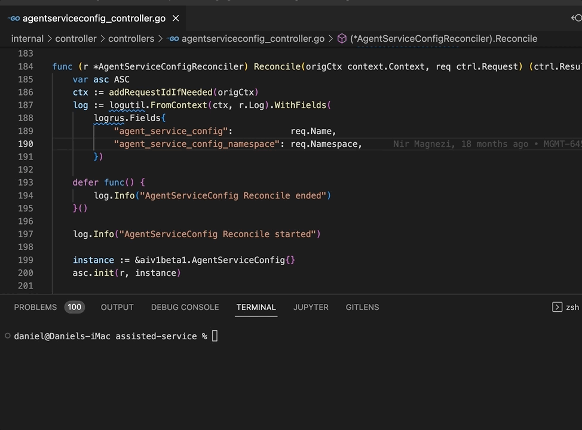

# Skipper for Visual Studio Code

The Skipper extension provides integration with the Command Palette (Ctrl+Shift+P on Linux/Windows and Cmd+Shift+P on Mac).

This extension relies on the [Skipper](https://github.com/Stratoscale/skipper) tool for invoking commands using the Command Palette.

Note: the illustrations here are based on [assisted-service](https://github.com/openshift/assisted-service) repository. 

## Features

The following command are supported in the Command Palette:

### skipper: make

Displays a list of targets available in the Makefile and invokes the selected target in terminal.

I.e. `skipper make <target>`

 
<em>(skipper make lint)</em>

### skipper: make generate

Filters only the `generate-*` targets for easier access.

 
<em>(skipper make generate-keys)</em>

### skipper: make unit-test

Invokes `unit-test` target on the package of the opened file.

I.e. `skipper make unit-test TEST=<file_path>`

 
<em>(skipper make unit-test)</em>

Apply cover profile to show test coverage:

 
<em>(Go: Apply Cover Profile)</em>

## Requirements

* [Skipper](https://github.com/Stratoscale/skipper) tool should be available in path.
* A Makefile in the codebase.
